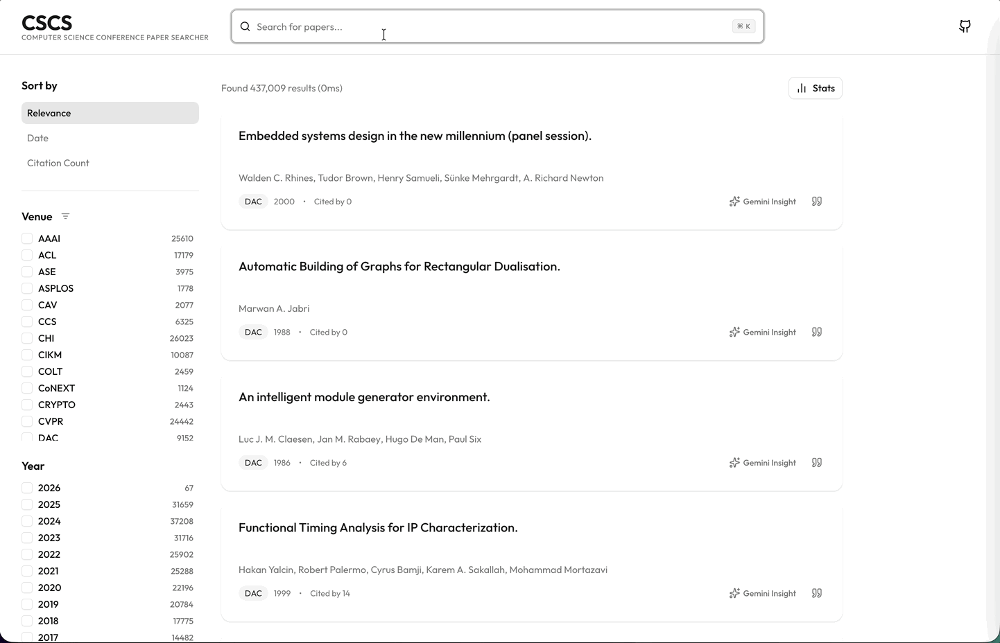
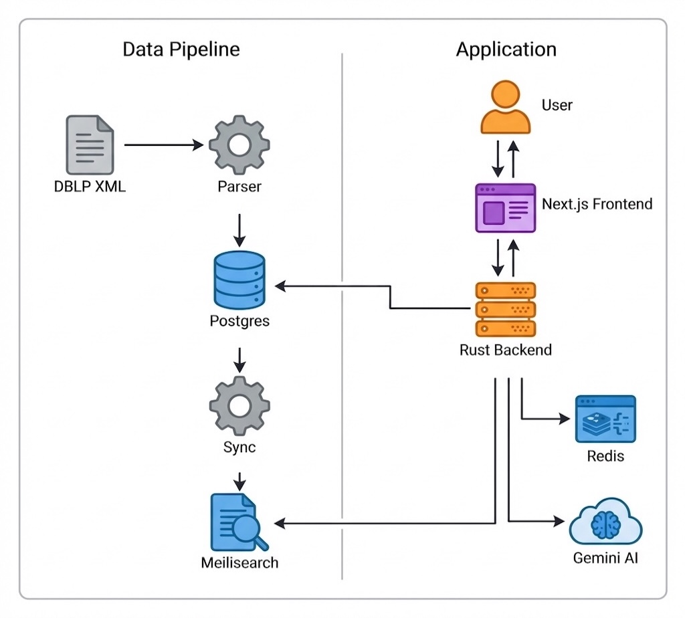

# CSCS: Computer Science Conference Paper Searcher

[](https://cscs.cbum.org/)
[](https://opensource.org/licenses/MIT)

**CSCS** is a high-performance academic search engine designed specifically for **Top-Tier Computer Science conference papers**. Built with speed and precision in mind, it leverages the power of Rust and Meilisearch to deliver instant results from the massive DBLP dataset.


## Key Features

-   **Blazing Fast Search**: Engineered with **Rust** and **Meilisearch** for millisecond-latency queries.
-   **Comprehensive Data**: Indexed with the vast **DBLP** computer science bibliography, specifically curated to include only **[top-tier conference papers](https://gist.github.com/Pusnow/6eb933355b5cb8d31ef1abcb3c3e1206)**.
-   **Modern Interface**: Responsive UI built with **Next.js 16**, **Tailwind CSS**, and **Radix UI**.
-   **Advanced Filtering**: Filter by year, venue, and more with granular control.

## Tech Stack

### Core
-   **Backend**: Rust (Axum Framework)
-   **Search Engine**: Meilisearch
-   **Frontend**: Next.js 16 (App Router), React 19, TypeScript

### Infrastructure & Data
-   **Database**: PostgreSQL
-   **Caching**: Redis
-   **Containerization**: Docker & Docker Compose

## Getting Started

Follow these steps to set up the project locally.

### Prerequisites

-   **Docker** and **Docker Compose**
-   **Node.js** (v20+) and **npm/pnpm**
-   **Rust** (latest stable)

### Installation

1.  **Clone the repository**
    ```bash
    git clone https://github.com/hynseok/cscs.git
    cd cscs
    ```

2.  **Start Infrastructure (DB, Search, Cache)**
    ```bash
    docker-compose up -d
    ```

3.  **Initialize Database**
    ```bash
    ./setup_db.sh
    ```

4.  **Populate Data**
    
    1.  Download the latest DBLP dump (`dblp.xml` and `dblp.dtd`) from [dblp.org](https://dblp.org/xml/) and place them in the `parser` directory.

    2.  Run the parser to import data into PostgreSQL:
        ```bash
        cd parser
        cargo run --release
        cd ..
        ```

    3.  Sync data to Meilisearch for fast searching:
        ```bash
        cd sync
        cargo run --release
        cd ..
        ```

5.  **Run Backend**
    ```bash
    cd backend
    cp .env.example .env # Configure your keys
    cargo run --release
    ```

6.  **Run Frontend**
    ```bash
    cd frontend
    cp .env.example .env # Configure your keys
    pnpm install
    pnpm dev
    ```

    The application will be available at `http://localhost:3000`.

## Architecture

CSCS employs a data-driven microservices architecture:



-   **Parser**: Rust-based CLI tool to parse XML DBLP dumps and populate Meilisearch/Postgres.
-   **Backend**: Rust API server handling search requests.
-   **Frontend**: Next.js client delivering a server-rendered, interactive experience.

## Public API

CSCS exposes a public, CORS-open search endpoint that anyone can call:

```
GET /api/v1/search
```

**Query parameters**

| Param   | Type              | Description                                        |
| ------- | ----------------- | -------------------------------------------------- |
| `q`     | string            | Search query (title, authors, venue, abstract).    |
| `venue` | string (repeated) | Filter by venue, e.g. `venue=OSDI&venue=SOSP`.     |
| `year`  | int (repeated)    | Filter by year, e.g. `year=2023&year=2024`.        |
| `sort`  | string            | `year` or `citation_count` (default: relevance).   |
| `page`  | int               | 1-based page number (default: `1`).                |
| `limit` | int               | Results per page (default: `20`, max: `100`).      |

**Example**

```bash
curl "https://cscs.cbum.org/api/v1/search?q=consensus&venue=OSDI&sort=citation_count&limit=5"
```

**Response**

```json
{
  "query": "consensus",
  "page": 1,
  "limit": 5,
  "total": 128,
  "count": 5,
  "results": [
    {
      "id": 12345,
      "title": "In Search of an Understandable Consensus Algorithm",
      "authors": ["Diego Ongaro", "John Ousterhout"],
      "venue": "USENIX ATC",
      "year": 2014,
      "citation_count": 4200,
      "url": "https://www.usenix.org/...",
      "dblp_key": "conf/usenix/OngaroO14",
      "abstract": "Raft is a consensus algorithm for managing a replicated log..."
    }
  ]
}
```

## License

This project is licensed under the [MIT License](LICENSE).
